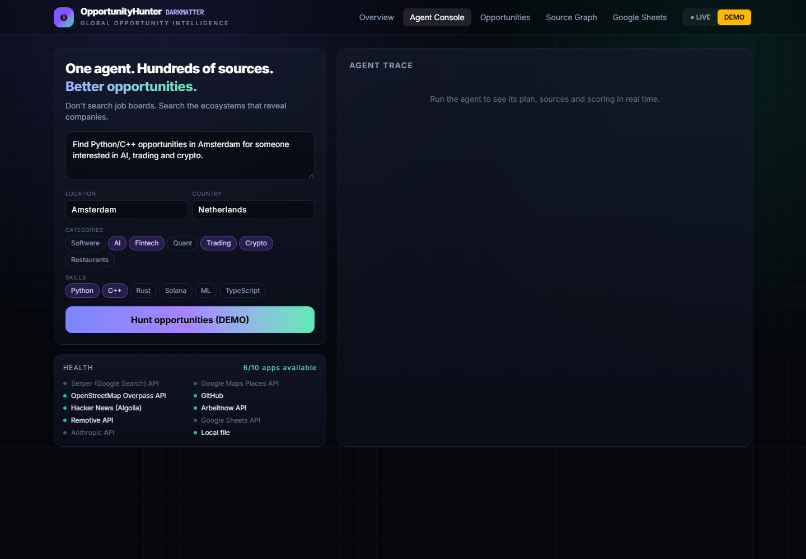
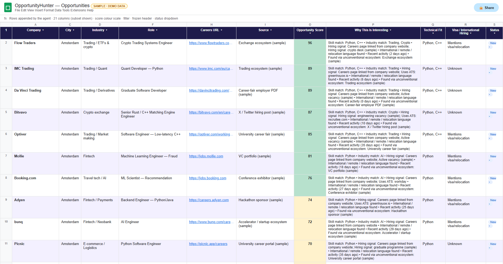

<div align="center">

# ◎ OpportunityHunter · `DARKMATTER`

### GLOBAL OPPORTUNITY INTELLIGENCE
**One agent. Hundreds of sources. Better opportunities.**

*An AI agent that searches the internet's hidden opportunity graph (university career fairs, founder hiring threads, maps, open source, trading ecosystems and curated lead reports) to find jobs, clients and companies before they reach the job boards.*

[](https://multiappagenthackathon.com/)
[](#-demo)
[](#-reliability--evaluation)


| 🖥️ Agent Console | 📗 Google Sheets output |
|---|---|
|  |  |

</div>

---

## 📑 Contents
[What it does](#-what-it-does) · [Demo](#-demo) · [Quick start](#-quick-start-5-minutes) · [Lead generation methods](#-every-way-it-generates-leads) · [External apps](#-external-apps) · [Architecture](#-architecture) · [Scoring](#-opportunity-scoring) · [Reliability](#-reliability--evaluation) · [Google Sheets](#-google-sheets-setup) · [Privacy](#-privacy--responsible-use) · [Roadmap](#-roadmap)

---

## 🎯 What it does

> **Most job seekers search job boards. OpportunityHunter searches the ecosystems that reveal companies.**

```text
SOURCE  ──▶  COMPANY  ──▶  PEOPLE  ──▶  HIRING SIGNAL  ──▶  OPPORTUNITY
```

You type one request, for example:

> *Find Python/C++ opportunities in Amsterdam for someone interested in AI, trading and crypto.*

The agent then:

| # | Step | What happens |
|---|---|---|
| 1 | 🧠 **Intent** | Extracts city, country, skills and industries (Claude if configured, otherwise rules). Works for any city |
| 2 | 🗺️ **Plan** | Writes 15+ searches: companies, skills, university career fairs, trading firms, VC portfolios, hackathon sponsors, X |
| 3 | 🌐 **Discover** | Queries every source **in parallel**, streaming live status to the dashboard |
| 4 | 🧬 **Deduplicate** | Merges the same company across sources and combines their signals and people |
| 5 | 🔎 **Research** | Visits each company's public homepage to find its careers page, hiring system (Greenhouse, Lever, Ashby…) and public inbox |
| 6 | 📊 **Score** | Scores 0–100 in 7 parts, with a written *why* and source links |
| 7 | 📤 **Deliver** | Dashboard, **Google Sheets**, CSV |

### Dashboard tabs
| Tab | Shows |
|---|---|
| **Overview** | KPIs, opportunities by source, score distribution, health |
| **Agent Console** | Search box with city, skill and category pickers, plus a live agent trace |
| **Opportunities** | Ranked table with HIGH / MEDIUM / LOW badges |
| **Company Intelligence** | Why we found it, hiring signals, score breakdown, people, links |
| **Source Graph** | Animated source graph with status for every source |
| **Google Sheets** | One-click sync, plus CSV download |

---

## 🎬 Demo

> ▶ **Demo video (≤ 2 min):** _add your YouTube/Loom link here_

| Time | What to show |
|---|---|
| 0:00 | *"I don't search for jobs. I search for the ecosystems that contain opportunities."* |
| 0:15 | Agent Console → type the request → **Hunt** |
| 0:35 | The search plan and source cards stream in (✓ counts and response times, ✕ failures handled) |
| 0:55 | Ranked opportunities with score badges |
| 1:20 | Click a company → Company Intelligence (why, hiring signals, people, source links) |
| 1:40 | **SYNC TO GOOGLE SHEETS** |
| 1:50 | Source Graph → *"It searches the world's ecosystems for opportunities."* |

**LIVE vs DEMO:** the header toggle picks the mode. **LIVE** calls the real connectors. **DEMO** replays a labelled sample dataset (amber `DEMO DATA` banner) so the video works even offline.

---

## 🚀 Quick start (5 minutes)

### Prerequisites
- **Node.js ≥ 18** — `node -v`
- **Python 3 + pandas + openpyxl** (only to import Excel lead reports) — `pip install pandas openpyxl`

### 1. Install and build
```bash
git clone https://github.com/<your-username>/opportunityhunter.git
cd opportunityhunter
npm run setup            # installs dashboard dependencies and builds it
```

### 2. Configure (optional; works with zero keys)
```bash
cp .env.example .env     # Windows: copy .env.example .env
```
Fill in any keys you have (see [Environment variables](#-environment-variables)).

### 3. Import your lead spreadsheets (optional)
```bash
npm run import:leads -- "E:\companies career leads\leads sent by freelancer"
# → reads every .xlsx and every sheet, finds the header rows, deduplicates
# → writes data/private/leads.json (git-ignored, never committed)
```

### 4. Run
```bash
npm start                # → http://localhost:8787
```
Open **http://localhost:8787**, pick **LIVE**, type a request and click **Hunt opportunities**.

Hot-reload development: run `npm start` and `npm run dev:web` in two terminals, then open http://localhost:5173.

### 5. Test
```bash
npm test                 # 7 tests, includes a real end-to-end run
OH_OFFLINE=1 npm test    # offline only
```

---

## 🧲 Every way it generates leads

| # | Method | Source | Finds | Status |
|---|---|---|---|---|
| 1 | 📁 **Freelancer lead reports** | Your Excel files (7 workbooks, 1,200+ unique companies) | Company, website, industry, contact name and title, LinkedIn, email, hiring signal, fit rationale | ✅ Live (local) |
| 2 | 🐙 **GitHub organizations** | GitHub REST API | Tech organizations located in the city, filtered by language; website and public email | ✅ Live |
| 3 | 🗞️ **Founder hiring threads** | Hacker News "Who is hiring" (Algolia API) | Founder- and engineer-written job posts that mention the city | ✅ Live |
| 4 | 🗺️ **Map discovery** | OpenStreetMap Overpass (any city) | IT, financial and research offices with websites | ✅ Live |
| 5 | 📍 **Google Maps** | Google Places API | "fintech companies Dubai", "restaurants Amsterdam" (local client leads) | 🔑 `GOOGLE_MAPS_API_KEY` |
| 6 | 🏢 **Company websites** | Direct HTTPS | Careers pages, hiring-system detection, generic public inbox | ✅ Live |
| 7 | 🇪🇺 **EU job board** | Arbeitnow API | Active European vacancies | ✅ Live |
| 8 | 🌍 **Remote jobs** | Remotive API | Remote roles open to your region | ✅ Live |
| 9 | 🎓 **University career fairs and employer lists** | Web search (Tavily / Serper) | Companies recruiting at local universities | 🔑 search key |
| 10 | 📈 **Trading and exchange ecosystems** | Web search | Market makers, prop firms, CME ecosystem | 🔑 search key |
| 11 | 💰 **VC portfolios and accelerators** | Web search | Funded startups that are hiring | 🔑 search key |
| 12 | 🏆 **Hackathon sponsors** | Web search | Companies sponsoring developer events | 🔑 search key |
| 13 | 𝕏 **X / Twitter hiring posts** | Web search (`site:x.com`) | Public hiring announcements | 🔑 search key |
| 14 | 🇦🇪 **DMCC directory (Dubai)** | Web search on `site:dmcc.ae` + DMCC Crypto Centre searches (added automatically for Dubai/UAE requests); DMCC Excel exports via `import:leads` | DMCC-registered companies by category | 🔑 search key / ✅ import |
| 15 | 🏛️ **Other business registries** (Singapore data.gov.sg, Companies House, KvK) | Official data or APIs | Registered companies by city | 🗓️ Roadmap |
| 16 | 👤 **People** | Lead reports and public pages; LinkedIn search opens **in your browser** | Founder, CTO, recruiter | ✅ Human in the loop |

Sources are pluggable: add one object to `LIVE_SOURCES` in [`server/sources.mjs`](server/sources.mjs) (`{ id, app, weight, configured(), search(intent) }`).

---

## 🔌 External apps

| App | Role | Auth |
|---|---|---|
| **Google Sheets API** | Operational database (21 columns) | Service account |
| **Google Maps Places API** | Company and business discovery | API key |
| **GitHub REST API** | Open-source company discovery | Optional token |
| **Hacker News Algolia API** | Founder hiring posts | None |
| **OpenStreetMap Overpass** | Map discovery worldwide | None |
| **Arbeitnow / Remotive** | Job boards | None |
| **Tavily / Serper** | Web search for the ecosystems above | API key |
| **Anthropic Claude** | Intent parsing | API key |

The **Health** panel shows exactly what is connected. A source counts as searched only if its connector actually ran.

---

## 🏗 Architecture

```text
┌──────────────────────────┐   Server-Sent Events   ┌──────────────────────────────────────────┐
│ React + TS + Tailwind UI │ ◀───────────────────── │ Node API (no dependencies)               │
│ console · table · graph  │                        │                                          │
└──────────────────────────┘                        │  INTENT ─▶ PLAN ─▶ DISCOVER (parallel)   │
                                                    │     ─▶ DEDUP ─▶ RESEARCH ─▶ SCORE        │
                                                    │     ─▶ GOOGLE SHEETS / CSV               │
                                                    └───────────────┬──────────────────────────┘
          ┌──────────┬──────────┬───────────┬──────────┬───────────┼───────────┬──────────┐
       Lead xlsx   GitHub    HN Algolia    OSM      Places     Job boards  Web search  Sites
```

| File | Purpose |
|---|---|
| [`server/agent.mjs`](server/agent.mjs) | Agent pipeline |
| [`server/sources.mjs`](server/sources.mjs) | Source registry and connectors |
| [`server/sheets.mjs`](server/sheets.mjs) | Google Sheets (service-account login, no SDK) and CSV |
| [`scripts/import_leads.py`](scripts/import_leads.py) | Excel lead importer |
| [`web/src/App.tsx`](web/src/App.tsx) | Dashboard |
| [`tests/reliability.test.mjs`](tests/reliability.test.mjs) | Reliability suite |

---

## 📊 Opportunity scoring

| Component | Max | Based on |
|---|---:|---|
| Technical fit | 25 | Skills matched as whole words |
| Company relevance | 20 | Industry match (Quant ↔ trading, Crypto ↔ web3…) |
| Hiring signal | 20 | Careers page, active vacancy, hiring system detected |
| International | 10 | Remote / visa / relocation wording |
| Recent activity | 10 | Activity in the last 30 / 120 days |
| Unconventional source | 10 | Source weight + bonus for appearing in several sources |
| Contactability | 5 | Careers URL, website, public contact |

🟢 **HIGH ≥ 75** · 🟡 **MEDIUM ≥ 55** · ⚪ LOW. Every result carries a `why[]` list and its source links.

---

## 🛡 Reliability & evaluation

| Test | Checks |
|---|---|
| Intent parser | Works for any city (Singapore) |
| Planner | Produces university, trading, VC, hackathon and X searches |
| Score invariants | Bounded 0–100, explained, parts add up to the total |
| Precision regression | "AI" does not match inside "email" |
| CSV contract | 21 columns; demo rows labelled |
| **Chaos** | Every source forced to fail → no crash |
| **Live end-to-end** | ≥ 3 external apps return data; every result has a source link |

**Design:** all sources run in parallel and one failing doesn't stop the others, with a 35-second timeout each. Claude falls back to rules and Sheets falls back to CSV. Success is shown only after a real write. Chaos test the running app with `OH_FORCE_FAIL=github,openstreetmap npm start`.

**Observed:** during testing, GitHub and the job-board APIs hit rate limits. The agent kept going and still returned 20 Singapore opportunities from the imported lead reports.

---

## 📗 Google Sheets setup

<div align="center">


<sub><b>Sample output:</b> the exact rows and columns the Sheets sync writes, from a DEMO run (no private contacts), rendered as a preview with <code>node scripts/sheet_preview.mjs</code>. After a real sync the sheet is styled automatically: dark frozen header, filters, green/amber/red score colour scale, banded rows, wrapped “Why” column and a status dropdown.</sub>

</div>


1. Go to [Google Cloud Console](https://console.cloud.google.com/) → create a project → **enable the Google Sheets API**.
2. **IAM & Admin → Service Accounts → Create** → Keys → Add key → JSON → save it as `credentials/service-account.json`.
3. Create a Google Sheet → **Share** it with the service account's `client_email` as **Editor**.
4. In `.env`, set `GOOGLE_SHEET_ID=` to the ID from the sheet URL (`/d/<ID>/edit`).
5. Restart with `npm start` → run the agent → **SYNC TO GOOGLE SHEETS**.

**Columns:** Company · Country · City · Industry · Opportunity Type · Role · Website · Careers URL · Source · Source URL · Founder · CTO · Recruiter · Public Professional Contact · Opportunity Score · Why This Is Interesting · Technical Fit · Visa / International Hiring · Status · Discovery Date · Notes

**Planned multi-tab workbook:** `Companies` · `Jobs` · `People` · `Application Tracker` (status dropdowns, follow-up dates) · `Dashboard`, with styled headers, frozen rows, filters, colour-coded scores and banded rows.

---

## ⚙ Environment variables

| Variable | Purpose |
|---|---|
| `TAVILY_API_KEY` / `SERPER_API_KEY` | Web search for the ecosystems |
| `GOOGLE_MAPS_API_KEY` | Google Places discovery |
| `GOOGLE_SHEET_ID`, `GOOGLE_SHEET_TAB`, `GOOGLE_SERVICE_ACCOUNT_FILE` | Google Sheets |
| `GITHUB_TOKEN` | Higher GitHub rate limits |
| `ANTHROPIC_API_KEY`, `ANTHROPIC_MODEL` | Claude intent parsing |
| `OH_FORCE_FAIL` | Chaos testing (comma-separated source ids) |
| `PORT` | Default `8787` |

---

## 🔒 Privacy & responsible use
- 🚫 No CAPTCHA bypass, no disguising the tool as a human visitor, no logging in to scrape, no hidden-field extraction.
- 🔐 Imported lead data (names, emails, LinkedIn URLs) stays in `data/private/`, which is **git-ignored**. Secrets live in `.env` / `credentials/`.
- 👤 People found on the web are limited to public professional information. LinkedIn is opened in your browser for manual review.
- ✅ Verify contacts before outreach, and follow anti-spam and data-protection law (GDPR / CAN-SPAM).

## ⚠ Limitations
- Without search or Places keys, the university, VC, hackathon, trading and X searches are planned but **not run**. The UI says so.
- Scoring is heuristic, and company-name deduplication can miss aliases.
- Imported lead reports are third-party research and may be stale.
- The demo dataset's signals are illustrative.

## 🗺 Roadmap
- [ ] Multi-tab formatted Google Sheets workbook (Companies / Jobs / People / Application Tracker / Dashboard)
- [ ] Official business-registry connectors (Singapore data.gov.sg, UK Companies House, OpenCorporates) and a directory connector that checks each site's terms
- [ ] Company-name extraction from career-fair PDFs
- [ ] Greenhouse / Lever / Ashby job-list APIs
- [ ] Outreach drafts for review, scheduled hunts, alerts for new HIGH opportunities

---

<div align="center">

**OpportunityHunter doesn't search one website for jobs.<br/>It searches the world's ecosystems for opportunities.**

</div>
